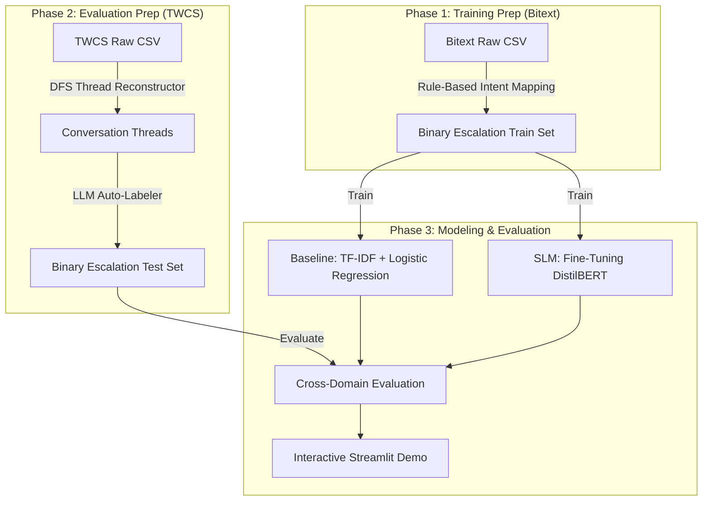

# Human-in-the-Loop: Cross-Domain Customer Support Escalation Classifier

[](https://opensource.org/licenses/MIT)
[](https://www.python.org/)
[](https://streamlit.io/)
[](https://huggingface.co/docs/transformers/model_doc/distilbert)

This repository contains the codebase and research framework for evaluating how well a Small Language Model (SLM) trained on structured intent data generalizes to noisy, real-world customer support interactions for escalation classification.

---

## 📌 Research Question

> **Can a fine-tuned small language model (DistilBERT) trained on clean, structured intent-labeled data (Bitext) generalize to classify customer support escalations in noisy, real-world conversational data (TWCS) compared to traditional baseline methods?**

### Why This Setup Matters
In industrial settings, building models from scratch is constrained by "cold start" scenarios where raw, labeled conversation data is scarce. Training a classifier on structured, synthetic, or templated datasets (like Bitext) and evaluating its generalization performance on unstructured, noisy real-world channels (like Twitter Customer Support) provides a rigorous benchmark for **domain generalization** and **model robustness**.

---

## 🗃️ Dataset Strategy & Roles

This project utilizes a two-dataset split to evaluate cross-domain generalization:

1. **Training Set: Bitext Customer Support Dataset**
   - *Characteristics:* 27K highly structured instruction-response pairs grouped by 27 intents and 10 categories.
   - *Labeling:* **Rule-Based (No LLM needed)**. Intents (such as `complaint`, `payment_issue`, `contact_human_agent`) are programmatically mapped directly to the binary escalation target:
     - `escalate = 1` (Requires human agent intervention)
     - `escalate = 0` (Can be handled by automated self-service bots)

2. **Cross-Domain Evaluation Set: Customer Support on Twitter (TWCS)**
   - *Characteristics:* Real-world, noisy social media posts featuring slang, abbreviations, emojis, and typos.
   - *Reconstruction:* programmatically woven into multi-turn threads by tracing parent-child reply relationships.
   - *Labeling:* **LLM-Assisted (Google Gemini 1.5 Flash)**. Raw conversation threads are labeled by `gemini-1.5-flash` to build a high-quality, real-world validation ground truth.

---

## 🛠️ Technical Pipeline & Methodology



### 1. Rule-Based Mapping (Bitext)
We classify each of the 27 intents in the Bitext dataset into binary targets. Since Bitext is clean and pre-categorized, mapping is instantaneous and deterministic.

### 2. Thread Reconstruction & LLM Labeling (TWCS)
We use a depth-first search (DFS) reply-chain parser to stitch together tweets into cohesive dialogues. An LLM acts as the evaluator to decide whether a customer thread requires a human escalation or could be handled by a bot.

### 3. Baseline Modeling
A classic machine learning pipeline (TF-IDF + Logistic Regression) is trained on the Bitext dataset to establish a performance floor.

### 4. SLM Fine-Tuning
A pre-trained **DistilBERT** model (`distilbert-base-uncased`) is fine-tuned on the Bitext training set, optimizing hyperparameters such as learning rate and batch size.

### 5. Performance Evaluation & Benchmarking
Both models are evaluated on the TWCS test set. We analyze:
- **Generalization Drop:** Performance on in-domain validation data (Bitext) vs. out-of-domain test data (TWCS).
- **Metric Breakdown:** F1-Score, Precision, Recall, and ROC-AUC.
- **Latency Benchmarks:** Inference time distribution (ms) on CPU vs. GPU.

---

## 📊 Results & Findings (EDA & Baseline Model)

Full interactive analysis, visual plots, and code execution can be viewed in our primary deliverable notebook:
👉 **[01_bitext_baseline_modeling.ipynb](file:///Users/weirui/dev/human-loop/notebooks/01_bitext_baseline_modeling.ipynb)**

### 1. Exploratory Data Analysis & Feature Engineering Insights
- **Data Hygiene & Deduplication:** Audit of the raw 26,872 instruction pairs revealed zero null values across core fields. However, exactly **2,237 duplicate instructions** (`~8.32%`) were identified and removed to eliminate data leakage between train and test partitions (`cleaned shape: 24,635 x 24`).
- **Target Class Imbalance:** Mapping the 27 intents to our binary `escalated` target yielded **17,770 Class 0 (Self-Service/Automated)** vs. **6,865 Class 1 (Escalated/Human Agent Needed)** records (`72.13% vs. 27.87%`). This realistic domain imbalance underscores why **F1-Score** and **ROC-AUC** must be prioritized over raw accuracy.
- **Linguistic & Structural Variations:** Decomposing the multi-character `flags` field demonstrated strong variations across categories. For instance, colloquialisms (`flag_colloquial`), typos (`flag_typos_errors`), and negations (`flag_negation`) appear with significantly different density inside complex billing and complaint queries compared to standard order tracking requests.

### 2. Baseline Model Performance (`TF-IDF + Logistic Regression`)
We evaluated a class-balanced Logistic Regression classifier trained on bigram TF-IDF representations (`max_features=10,000`, `ngram_range=(1,2)`) over a stratified 20% test split (`4,927` queries):

| Metric | Score | Rationale & Interpretation |
| :--- | :--- | :--- |
| **F1-Score (Macro/Weighted)** | **0.9964** | Perfectly balances Precision (preventing agent overload) and Recall (catching critical complaints). |
| **ROC-AUC** | **0.9999** | Demonstrates near-perfect discrimination across all decision thresholds on clean structured data. |
| **Accuracy** | **0.9980** | Baseline ceiling on clean, templated in-domain data. |
| **Precision (Escalated)** | **0.9964** | Extremely low false-positive escalation rate. |
| **Recall (Escalated)** | **0.9964** | Exactly 5 false negatives out of 1,373 actual escalations. |
| **Inference Latency** | **0.1293 ms/query** | High-speed benchmark (over 500 test runs) establishing the latency ceiling for real-time customer service deployment. |

### Why Does the Linear Baseline Score So High?
The Bitext dataset is synthetically generated with standardized entity placeholders (`{{Order Number}}`, `{{Customer Support Email}}`) and highly distinct lexical markers for each intent. A linear TF-IDF classifier easily separates these exact keyword patterns in-domain. 

**Next Steps (Cross-Domain Generalization):** When deployed against unstructured, non-templated, noisy real-world tweets (Twitter Customer Support dataset), n-gram models suffer severe performance degradation. Below is our empirical benchmark quantifying this drop across our 20K labeled evaluation threads alongside our target-domain Twitter baseline:

### 3. Cross-Domain Generalization Benchmark (`Bitext -> TWCS`)
To quantify the vulnerability of surface-level lexical representations (`TF-IDF`), we evaluated our Bitext-trained baseline classifier directly against multi-turn dialogue threads from Twitter (`TWCS`), alongside an In-Domain Twitter baseline trained via an 80/20 split (`models/twcs/twcs_metrics.json`).

| Metric | Bitext (In-Domain Ceiling) | TWCS In-Domain (80/20 Split) | TWCS Cross-Domain (Bitext -> Twitter) | Generalization Drop (Clean vs. Cross) |
| :--- | :---: | :---: | :---: | :---: |
| **Macro F1-Score** | **0.9964** | **0.8120** | **0.5444** | **-0.4520** |
| **ROC-AUC** | 0.9999 | 0.8963 | 0.5462 | -0.4537 |
| **Accuracy** | 0.9980 | 0.8123 | 0.5975 | -0.4005 |
| **Precision (Macro)** | 0.9964 | 0.8120 | 0.5901 | -0.4063 |
| **Recall (Macro)** | 0.9964 | 0.8132 | 0.5592 | -0.4372 |

**Key Benchmarking Takeaways:**
- **Lexical Overfitting & Domain Shift:** The linear n-gram model drops by over **45 percentage points** in Macro F1 when transitioned from structured instructions (`Bitext`) to noisy social media threads (`TWCS`). Without semantic abstraction, TF-IDF cannot recognize that slang (`wtf`, `sux`, `pls help`) or multi-turn conversational patterns map to the exact same customer intents trained in Bitext.
- **In-Domain Twitter Floor vs. Architectural Ceiling (`0.8120` F1):** When a TF-IDF + Logistic Regression pipeline is trained directly on target Twitter vocabulary (`models/twcs/twcs_metrics.json`), Macro F1 rebounds significantly to `0.8120` (`+26.76%`). This proves that vocabulary mismatch accounts for roughly half of the cross-domain degradation. However, linear TF-IDF still hits a hard ceiling at `0.8120` (`430 False Negatives`), showing that deep contextual representations (**DistilBERT**) are required to capture multi-turn dialogue progression and negation across channels.

In **Module 24**, we fine-tune **DistilBERT** (`distilbert-base-uncased`) to overcome this lexical brittleness and establish robust cross-domain classification.

---

## 📁 Repository Structure

```text
human-loop/
├── data/                       # Dataset storage (ignored by Git)
│   ├── bitext/                 # Bitext training dataset
│   └── twcs/                   # Twitter Customer Support dataset
├── models/                     # Serialized artifacts & evaluation metrics
│   ├── bitext/                 # Bitext-trained baseline artifacts
│   │   ├── tfidf_bitext.pkl
│   │   └── bitext_metrics.json
│   ├── twcs/                   # TWCS-trained baseline artifacts
│   │   ├── tfidf_twcs.pkl
│   │   └── twcs_metrics.json
│   └── cross_domain_metrics.json # Evaluation bridge results
├── notebooks/                  # Jupyter notebooks for EDA and experimentation
│   ├── 01_bitext_baseline_modeling.ipynb # Primary EDA & baseline modeling notebook
│   └── 02_twcs_baseline_modeling.ipynb # TWCS thread reconstruction & cross-domain evaluation
├── src/                        # Core codebase
│   ├── __init__.py
│   ├── bitext/                 # Source domain (Bitext) pipeline
│   │   ├── __init__.py
│   │   ├── preprocess_bitext.py    # Rule-based intent-to-escalate mapper & feature engineer
│   │   └── train_bitext.py         # Pipeline for TF-IDF baseline training on Bitext
│   ├── twcs/                   # Target domain (TWCS) pipeline
│   │   ├── __init__.py
│   │   ├── reconstruct_conversations.py # Weaves raw tweets into thread sequences
│   │   ├── autonomous_labeler.py   # Autonomous batch labeling engine with checkpointing & rate limits
│   │   ├── label_twcs.py           # LLM auto-labeler execution script for TWCS evaluation threads
│   │   └── train_twcs.py           # Pipeline for TF-IDF in-domain training on TWCS (80/20 split)
│   └── evaluate.py             # Cross-domain benchmarking & metrics computation
├── app.py                      # Interactive Streamlit Demo
├── requirements.txt            # Python dependencies
└── README.md                   # Project documentation
```

### File Reference Quicklinks:
- [README.md](file:///Users/weirui/dev/human-loop/README.md)
- [notebooks/01_bitext_baseline_modeling.ipynb](file:///Users/weirui/dev/human-loop/notebooks/01_bitext_baseline_modeling.ipynb)
- [notebooks/02_twcs_baseline_modeling.ipynb](file:///Users/weirui/dev/human-loop/notebooks/02_twcs_baseline_modeling.ipynb)
- [app.py](file:///Users/weirui/dev/human-loop/app.py)
- [src/bitext/preprocess_bitext.py](file:///Users/weirui/dev/human-loop/src/bitext/preprocess_bitext.py)
- [src/bitext/train_bitext.py](file:///Users/weirui/dev/human-loop/src/bitext/train_bitext.py)
- [src/twcs/reconstruct_conversations.py](file:///Users/weirui/dev/human-loop/src/twcs/reconstruct_conversations.py)
- [src/twcs/autonomous_labeler.py](file:///Users/weirui/dev/human-loop/src/twcs/autonomous_labeler.py)
- [src/twcs/label_twcs.py](file:///Users/weirui/dev/human-loop/src/twcs/label_twcs.py)
- [src/twcs/train_twcs.py](file:///Users/weirui/dev/human-loop/src/twcs/train_twcs.py)
- [src/evaluate.py](file:///Users/weirui/dev/human-loop/src/evaluate.py)

---

## 🚀 Quick Start & Setup

### Prerequisites
- Python 3.10 or higher
- Optional: CUDA-capable GPU for faster DistilBERT training

### 1. Clone & Install Dependencies
```bash
git clone https://github.com/your-username/human-loop.git
cd human-loop
pip install -r requirements.txt
```

*Note: You can also use [uv](https://github.com/astral-sh/uv) for lightning-fast installation:*
```bash
uv pip install -r requirements.txt
```

### 2. Configure Environment Variables
Create a `.env` file in the root directory and add your Google Gemini API key for the TWCS labeling pipeline:
```env
GEMINI_API_KEY=your_gemini_api_key_here
```

### 3. Run Preprocessing and Thread Reconstruction
Prepare the training data:
```bash
python3 src/bitext/preprocess_bitext.py
```

Stitch and label the Twitter validation data:
```bash
python3 src/twcs/reconstruct_conversations.py
python3 src/twcs/label_twcs.py
```

### 4. Train the Models
Train the baseline models:
```bash
python3 src/bitext/train_bitext.py
python3 src/twcs/train_twcs.py
```

### 5. Launch the Streamlit Demo
```bash
streamlit run app.py
```

---

## 📄 License
This project is licensed under the MIT License - see the LICENSE file for details.