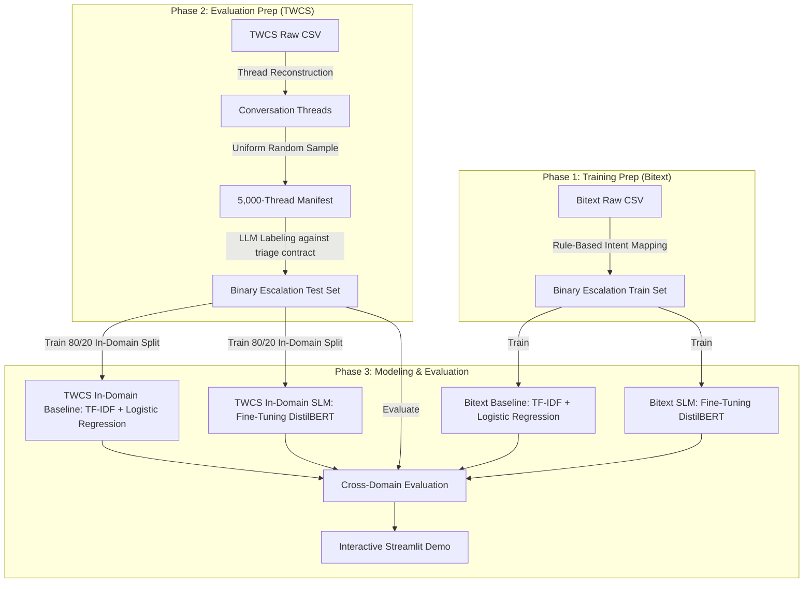
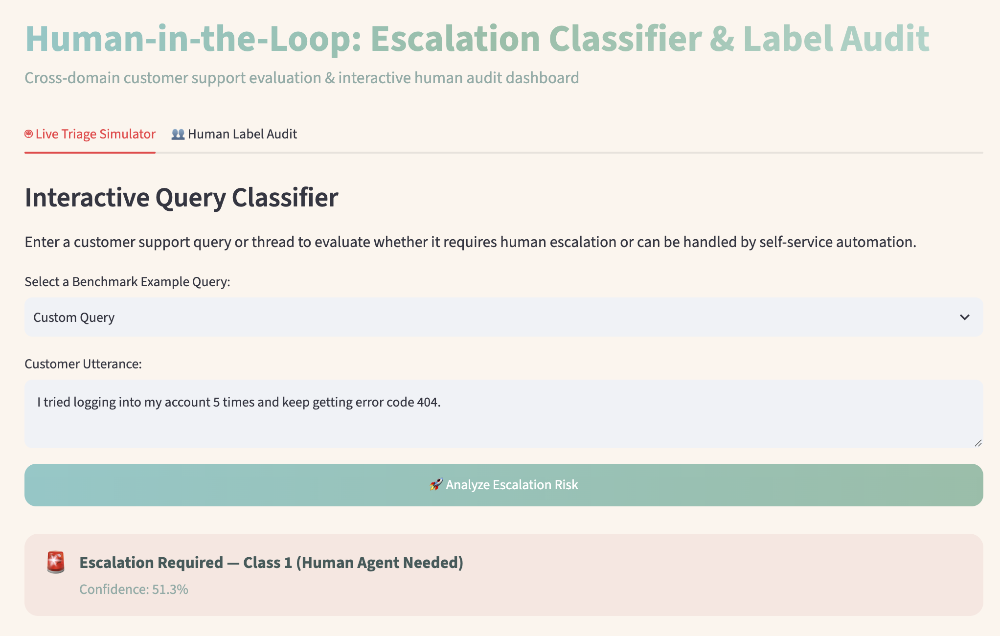

# Human-in-the-Loop: Cross-Domain Customer Support Escalation Classifier

[](https://opensource.org/licenses/MIT)
[](https://www.python.org/)
[](https://streamlit.io/)
[](https://huggingface.co/docs/transformers/model_doc/distilbert)

This repository contains the codebase and research framework for evaluating how well a Small Language Model (SLM) trained on structured intent data generalizes to noisy, real-world customer support interactions for escalation classification.

---

## 📌 Research Question

> **Can a fine-tuned small language model (DistilBERT) trained on clean, structured intent-labeled data (Bitext) generalize to classify customer support escalations in noisy, real-world conversational data (TWCS) compared to traditional baseline methods?**

### Why This Setup Matters
In industrial settings, building models from scratch is constrained by "cold start" scenarios where raw, labeled conversation data is scarce. Training a classifier on structured, synthetic, or templated datasets (like Bitext) and evaluating its generalization performance on unstructured, noisy real-world channels (like Twitter Customer Support) provides a rigorous benchmark for **domain generalization** and **model robustness**.

---

## 🗃️ Dataset Strategy & Roles

This project utilizes a two-dataset split to evaluate cross-domain generalization:

1. **Training Set: Bitext Customer Support Dataset**
   - *Characteristics:* 27K highly structured instruction-response pairs grouped by 27 intents and 10 categories.
   - *Labeling:* **Rule-Based (No LLM needed)**. Intents (such as `complaint`, `payment_issue`, `contact_human_agent`) are programmatically mapped directly to the binary escalation target:
     - `escalate = 1` (Requires human agent intervention)
     - `escalate = 0` (Can be handled by automated self-service bots)

2. **Cross-Domain Evaluation Set: Customer Support on Twitter (TWCS)**
   - *Characteristics:* Real-world, noisy social media posts featuring slang, abbreviations, emojis, and typos.
   - *Reconstruction:* Programmatically woven into multi-turn threads by tracing parent-child reply relationships.
   - *LLM Labeling:* A **5,000-thread uniform random sample** is labeled **by an LLM**, one thread at a time, against a published triage contract defining the 7 escalation categories.
   - *What the Labeler Sees:* The customer's **opening message only** — no agent replies, no `turn_count`. This matches the feature column the downstream classifier receives, so no label carries information the model cannot see.
   - *Dual Role:* Beyond serving as the cross-domain evaluation set for the Bitext-trained models, this labeled TWCS data is **also** split 80/20 to train **in-domain reference models** (TF-IDF and DistilBERT) on target Twitter vocabulary. These establish the achievable upper bound when real-world labels *are* available, isolating how much of the cross-domain gap stems from vocabulary mismatch versus model architecture.

---

## 🛠️ Technical Pipeline & Methodology


```mermaid
graph TD
    subgraph P1["Phase 1: Training Prep (Bitext)"]
        A1[Bitext Raw CSV] -->|Rule-Based Intent Mapping| B1[Binary Escalation Train Set]
    end

    subgraph P2["Phase 2: Evaluation Prep (TWCS)"]
        A2[TWCS Raw CSV] -->|Thread Reconstruction| B2[Conversation Threads]
        B2 -->|Uniform Random Sample| B3[5,000-Thread Manifest]
        B3 -->|LLM Labeling against triage contract| C2[Binary Escalation Test Set]
    end

    subgraph P3["Phase 3: Modeling & Evaluation"]
        B1 -->|Train| D[Bitext Baseline: TF-IDF + Logistic Regression]
        B1 -->|Train| E[Bitext SLM: Fine-Tuning DistilBERT]
        C2 -->|Train 80/20 In-Domain Split| H[TWCS In-Domain Baseline: TF-IDF + Logistic Regression]
        C2 -->|Train 80/20 In-Domain Split| I[TWCS In-Domain SLM: Fine-Tuning DistilBERT]
        C2 -->|Evaluate| F[Cross-Domain Evaluation]
        D --> F
        E --> F
        H --> F
        I --> F
        F --> G[Interactive Streamlit Demo]
    end
```

### 1. Rule-Based Mapping (Bitext)
We classify each of the 27 intents in the Bitext dataset into binary targets (`escalated = 1` vs. `escalated = 0`). Since Bitext is clean and pre-categorized, mapping is deterministic.

#### 📌 Operational Rationale for the 7 Escalated Intents (`escalated = 1`)
Out of the 27 Bitext intents, exactly 7 are designated as requiring human escalation based on standard Customer Experience (CX) and Operations taxonomy:

1. **Direct request of human agent:**
   - `contact_human_agent`, `contact_customer_service`: Direct customer requests for human intervention. Bypassing this request causes immediate CSAT drop.
2. **Negative Sentiment:**
   - `complaint`: Angry or dissatisfied customers require human empathy, negotiation, or goodwill compensation (discounts/vouchers) that bots cannot manage.
3. **Financial Liability:**
   - `payment_issue`, `get_refund`, `check_cancellation_fee`: Disbursing funds, failed transaction troubleshooting, or penalty fee disputes involve financial risk and policy overrides requiring human authorization.
4. **Account Access Blockers:**
   - `registration_problems`: Signup failures prevent new customer acquisition and require technical or identity verification.

The remaining 20 intents (`track_order`, `recover_password`, `delivery_period`, `check_invoice`, etc.) represent static FAQ lookups or deterministic API operations suitable for automated self-service bots (`escalated = 0`).

> ⚠️ **Two of those self-service mappings do not hold in the target domain.** In Bitext, `recover_password` and `check_invoice` are routine automated lookups. In real Twitter traffic the equivalent messages are *"my password is rejected and the 2FA code never arrives"* and *"you charged me twice, where is my money"* — cases that need a human. This label-space collision is the largest single source of cross-domain error we measured; see [Per-Category Cross-Domain Recall](#per-category-cross-domain-recall).

### 2. Thread Reconstruction & LLM Labeling (TWCS)
Raw tweets are stitched into multi-turn dialogues by following parent-child reply links. A **5,000-thread uniform random sample** is then labeled by an LLM (`claude-opus-5`), one thread at a time, against a published triage contract — the 7 escalation categories, the self-service categories, and the severity bar for `complaint`. The labeler sees the customer's **opening message only**: no agent replies. Every row records a free-text `reason`, so any label can be re-argued from the record.

> These labels are generated entirely by `claude-opus-5`. Given that the downstream models under evaluation are TF-IDF and DistilBERT, a frontier LLM provides a sufficiently reliable ground truth for this comparison. The Streamlit dashboard includes a human audit interface for reviewing and correcting labels to further strengthen the dataset.

### 3. Baseline Modeling
A classic machine learning pipeline (TF-IDF + Logistic Regression) is trained on the Bitext dataset to establish a performance floor. We additionally train a second, **in-domain** TF-IDF + Logistic Regression baseline directly on TWCS (80/20 split) to measure the ceiling achievable with target-domain vocabulary.

### 4. SLM Fine-Tuning
A pre-trained **DistilBERT** model (`distilbert-base-uncased`) is fine-tuned on the Bitext training set, optimizing hyperparameters such as learning rate and batch size. In parallel, we fine-tune an **in-domain** DistilBERT on the TWCS 80/20 split, giving us both a cross-domain and an in-domain SLM for comparison.

### 5. Performance Evaluation & Benchmarking
The Bitext-trained models are evaluated **cross-domain** on the full TWCS test set, while the TWCS-trained models are evaluated **in-domain** on their held-out 20% split. We analyze:
- **Generalization Drop:** Cross-domain performance (Bitext → TWCS) against both the in-domain Bitext ceiling and the in-domain TWCS reference.
- **Metric Breakdown:** F1-Score, Precision, Recall, and ROC-AUC.
- **Latency Benchmarks:** Inference time distribution (ms) on CPU vs. GPU.

---

## 📊 Results & Findings (EDA & Baseline Model)

Full interactive analysis, visual plots, and code execution can be viewed in our primary deliverable notebook:
👉 **[01_bitext_baseline_modeling.ipynb](notebooks/01_bitext_baseline_modeling.ipynb)**

### 1. Exploratory Data Analysis & Feature Engineering Insights
- **Data Hygiene & Deduplication:** Audit of the raw 26,872 instruction pairs revealed zero null values across core fields. However, exactly **2,237 duplicate instructions** (`~8.32%`) were identified and removed to eliminate data leakage between train and test partitions (`cleaned shape: 24,635 x 24`).
- **Target Class Imbalance:** Mapping the 27 intents to our binary `escalated` target yielded **17,770 Class 0 (Self-Service/Automated)** vs. **6,865 Class 1 (Escalated/Human Agent Needed)** records (`72.13% vs. 27.87%`). This realistic domain imbalance underscores why **F1-Score** and **ROC-AUC** must be prioritized over raw accuracy.
- **Linguistic & Structural Variations:** Decomposing the multi-character `flags` field demonstrated strong variations across categories. For instance, colloquialisms (`flag_colloquial`), typos (`flag_typos_errors`), and negations (`flag_negation`) appear with significantly different density inside complex billing and complaint queries compared to standard order tracking requests.

### 2. Baseline Model Performance (`TF-IDF + Logistic Regression`)
We evaluated a class-balanced Logistic Regression classifier trained on bigram TF-IDF representations (`max_features=10,000`, `ngram_range=(1,2)`) over a stratified 20% test split (`4,927` queries):

| Metric | Score | Rationale & Interpretation |
| :--- | :--- | :--- |
| **Macro F1-Score** | **0.9975** | Perfectly balances Precision (preventing agent overload) and Recall (catching critical complaints). |
| **ROC-AUC** | **0.9999** | Demonstrates near-perfect discrimination across all decision thresholds on clean structured data. |
| **Accuracy** | **0.9980** | Baseline ceiling on clean, templated in-domain data. |
| **Precision (Macro)** | **0.9975** | Extremely low false-positive escalation rate. |
| **Recall (Macro)** | **0.9975** | Exactly 5 false negatives out of 1,373 actual escalations. |
| **Inference Latency** | **0.1293 ms/query** | High-speed benchmark (over 500 test runs) establishing the latency ceiling for real-time customer service deployment. |

### Why Does the Linear Baseline Score So High?
The Bitext dataset is synthetically generated with standardized entity placeholders (`{{Order Number}}`, `{{Customer Support Email}}`) and highly distinct lexical markers for each intent. A linear TF-IDF classifier easily separates these exact keyword patterns in-domain. 

**Next Steps (Cross-Domain Generalization):** When deployed against unstructured, non-templated, noisy real-world tweets (Twitter Customer Support dataset), n-gram models suffer severe performance degradation. The benchmark below quantifies that drop against the LLM-labeled sample.

### 3. Cross-Domain Generalization Benchmark (`Bitext -> TWCS`)

To quantify the vulnerability of surface-level lexical representations (`TF-IDF`), we evaluated our Bitext-trained baseline classifier directly against the **5,000-thread LLM-labeled TWCS sample**, alongside an In-Domain Twitter baseline retrained on an 80/20 split of the same labels (`models/twcs/tfidf/twcs_metrics.json`). Both use `first_customer_text` — the customer's opening message, exactly what the LLM labeler saw.

| Metric | Bitext (In-Domain Ceiling) | TWCS In-Domain (80/20 Split) | TWCS Cross-Domain (Bitext -> Twitter) | Generalization Drop (Clean vs. Cross) |
| :--- | :---: | :---: | :---: | :---: |
| **Macro F1-Score** | **0.9975** | **0.7327** | **0.5816** | **-0.4159** |
| ROC-AUC | 0.9999 | 0.8258 | 0.5811 | -0.4188 |
| Accuracy | 0.9980 | 0.7640 | 0.6604 | -0.3376 |
| Precision (Macro) | 0.9975 | 0.7264 | 0.5874 | -0.4090 |
| Recall (Macro) | 0.9975 | 0.7432 | 0.5792 | -0.4172 |

### Per-Category Cross-Domain Recall

A single F1 hides the mechanism. Because each escalated thread carries its Bitext intent, we can see which intents survive the shift:

| Escalation intent | Threads | Cross-domain recall |
| :--- | :---: | :---: |
| `check_cancellation_fee` | 18 | **0.72** |
| `contact_human_agent` | 65 | 0.60 |
| `get_refund` | 112 | 0.52 |
| `contact_customer_service` | 169 | 0.52 |
| `payment_issue` | 281 | 0.35 |
| `complaint` | 759 | 0.32 |
| `registration_problems` | 125 | **0.20** |

**Key Benchmarking Takeaways:**
- **Lexical Overfitting & Domain Shift:** The linear n-gram model drops **41 percentage points** in Macro F1 moving from structured instructions (`Bitext`) to noisy social media threads (`TWCS`). Without semantic abstraction, TF-IDF cannot recognise that slang (`wtf`, `sux`, `pls help`) maps to the intents it trained on.
- **Vocabulary mismatch explains ~15 points, not half the gap.** Retraining on target-domain vocabulary buys `+0.1511` F1 (`0.5816 -> 0.7327`). The remaining `0.2648` to the synthetic ceiling is an architectural limit, not a vocabulary one.
- **The in-domain ceiling is `0.7327`.** That is what a linear n-gram model extracts from the customer's opening message alone — the only text available at triage time, before any reply exists.
- **The worst failures are a taxonomy collision, not just noise.** `registration_problems` (0.20) and `payment_issue` (0.35) are *functional* intents with distinctive vocabulary and should have been easy. They fail because Bitext maps `recover_password` and `check_invoice` to **self-service (0)**, while in real Twitter traffic a lockout or a missing payment is exactly what needs a human. The model matches the words correctly and applies the wrong rule. The two categories a support desk can least afford to misroute — locked-out users and missing money — are the two this baseline is worst at catching.

We then fine-tuned **DistilBERT** (`distilbert-base-uncased`) to test whether semantic representations overcome this lexical brittleness. They do not — at least not transferred zero-shot. The results are below.

---

## 🤖 Results & Findings (DistilBERT SLM)

Full analysis in **[03_bitext_distilbert.ipynb](notebooks/03_bitext_distilbert.ipynb)** and **[04_twcs_distilbert.ipynb](notebooks/04_twcs_distilbert.ipynb)**. Both notebooks reuse the *exact* 80/20 splits of the baselines (`random_state=42`) and verify it by re-scoring the serialized TF-IDF pipelines on the reconstructed test sets before making any comparison.

> All F1 figures in this project are **macro** — averaged over both classes.

### 1. The Complete 2×2 Benchmark

| | **Bitext In-Domain** (synthetic ceiling) | **TWCS Cross-Domain** (zero-shot) | **TWCS In-Domain** (80/20 real labels) |
| :--- | :---: | :---: | :---: |
| **TF-IDF + Logistic Regression** | 0.9975 | 0.5816 | 0.7327 |
| **DistilBERT** | **0.9982** | 0.5670 | **0.7965** |

### 2. Decomposing the Gap

| Component | Macro F1 | Reading |
| :--- | :---: | :--- |
| **Vocabulary gap** (TF-IDF) | **+0.1511** | What target-domain labels buy the linear family. |
| **Vocabulary gap** (DistilBERT) | **+0.2295** | What they buy the transformer — the largest single term in the study. |
| **Architecture gap**, in-domain | +0.0638 | What the transformer adds with training data held constant. |
| **Architecture gap**, zero-shot | **−0.0146** | Transferred cold from synthetic data, the transformer is *behind* the baseline. |
| **Irreducible remainder** | 0.2010 | `0.9975` ceiling − `0.7965` best real-data result. Recovered by neither data nor architecture. |

### 3. Key Findings

- **The synthetic in-domain benchmark is uninformative.** DistilBERT beats the bigram baseline by `0.0007` on Bitext — a handful of rows out of 4,927. Templated text with entity slots is linearly separable, so a benchmark run only there ranks the two architectures as equivalent and measures a property of the *corpus*, not the models.
- **Zero-shot transfer is not deployable, and the transformer is not the fix.** DistilBERT posts the *higher* ROC-AUC (`0.6271` vs `0.5811`) but the *lower* macro F1 (`0.5670` vs `0.5816`). Fitting Bitext to a training loss near `0.001` left it emitting saturated probabilities that collapse toward the majority class off-distribution: its optimal cross-domain threshold is **`0.01`**, not `0.50`. Even granting each model its best threshold — an oracle upper bound — the gap only narrows to `0.003` and never reverses.
- **Target-domain labels are worth ~3–4x more than architecture.** `+0.1511`/`+0.2295` from labels versus `+0.0638` from the architecture. **The implication is a labeling budget, not a model upgrade** — and the transformer pays off *after* the labels exist, not instead of them.
- **The in-domain gain is precision, not recall.** DistilBERT trades recall for precision rather than dominating on both. Macro F1 rewards that trade; a support desk might not. Notebook 04 therefore sets the operating point explicitly, and the macro-F1 curve is nearly flat across `0.20–0.55` — so where the errors land is very nearly a free choice.
- **The taxonomy collision is a labeling-design lesson, not a modelling one.** Both architectures failed hardest on the same categories cross-domain, and in nearly the same rank order, because both inherited the Bitext mapping of `recover_password` and `check_invoice` to self-service. Trained on TWCS labels that never carried that error, `registration_problems` and `payment_issue` recover sharply. **No encoder can out-model a definition mistake.**
- **Casing buys nothing.** Swapping in `distilbert-base-cased` — same size, same loop, 3 seeds — moves macro F1 by `−0.0042`, a sixth of the seed-to-seed spread. A smaller vocabulary stretched over two cases fragments harder, spending 6% more tokens and 23% more `[UNK]` on every row to recover an emphasis signal present in 12% of them. The uncased default stands, now tested rather than assumed.
- **Latency is a real but affordable cost.** `~5–7 ms/query` on Apple Silicon GPU and `~9–10 ms` on CPU, single-instance, against the baseline's `0.127 ms` — roughly 45x slower, and still far inside any interactive budget.

### 4. Deployment Recommendation
Route on the **TWCS in-domain DistilBERT** at a threshold of `0.20–0.30`. Keep TF-IDF as a fallback tier where microsecond latency matters — it retains 93% of the transformer's in-domain macro F1 at ~1/45th the cost. Treat the Bitext-trained models as a cold-start bootstrap for a queue with no labels yet, to be retired once a few thousand real ones exist.

---

## 📁 Repository Structure

```text
human-loop/
├── data/                       # Dataset storage (ignored by Git)
│   ├── bitext/                 # Bitext training dataset
│   └── twcs/                   # Twitter Customer Support dataset
├── models/                     # Serialized artifacts & evaluation metrics
│   ├── cross_domain_metrics_tfidf.json      # Bitext -> TWCS, TF-IDF
│   ├── cross_domain_metrics_distilbert.json # Bitext -> TWCS, DistilBERT
│   ├── final_benchmark.json    # Four-model 2x2 summary & gap decomposition
│   ├── bitext/
│   │   ├── tfidf/              # tfidf_bitext.pkl, bitext_metrics.json
│   │   └── distilbert/         # weights (gitignored) + bitext_distilbert_metrics.json
│   └── twcs/
│       ├── tfidf/              # tfidf_twcs.pkl, twcs_metrics.json
│       └── distilbert/         # weights (gitignored) + twcs_distilbert_metrics.json,
│                               #   casing_comparison.json
├── src/
│   └── distilbert_utils.py     # Fine-tuning loop used by notebooks 03-05
├── notebooks/                  # Jupyter notebooks for EDA and experimentation
│   ├── 01_bitext_baseline_modeling.ipynb # Primary EDA & baseline modeling notebook
│   ├── 02_twcs_baseline_modeling.ipynb # TWCS cross-domain evaluation & in-domain TF-IDF baseline
│   ├── 03_bitext_distilbert.ipynb # DistilBERT on Bitext + cross-domain transfer
│   ├── 04_twcs_distilbert.ipynb # DistilBERT in-domain on TWCS + final 2x2 benchmark
│   └── 05_casing_comparison.ipynb # Casing comparison (uncased vs cased)
├── docs/                       # Screenshots and documentation assets
│   └── ui.png
├── app.py                      # Interactive Streamlit demo & label review UI
├── requirements.txt            # Python dependencies
└── README.md                   # Project documentation
```

---

## 📓 Explore the Notebooks

The full analysis, visualizations, and results are already captured in the five notebooks below — the datasets have been preprocessed, labeled, and modeled, and the trained artifacts live in [`models/`](models/). **No re-running of the pipeline is required to follow the work** — just open the notebooks:

| Notebook | What's Inside |
| :--- | :--- |
| **[01_bitext_baseline_modeling.ipynb](notebooks/01_bitext_baseline_modeling.ipynb)** | EDA, data cleaning, feature engineering, and the in-domain TF-IDF + Logistic Regression baseline on the Bitext dataset (`macro F1 = 0.9975`). |
| **[02_twcs_baseline_modeling.ipynb](notebooks/02_twcs_baseline_modeling.ipynb)** | The cross-domain vs. in-domain benchmark on the LLM-labeled sample (`0.5816` cross-domain vs. `0.7327` in-domain F1), plus per-category recall. |
| **[03_bitext_distilbert.ipynb](notebooks/03_bitext_distilbert.ipynb)** | DistilBERT fine-tuned on Bitext (`0.9982` in-domain), its zero-shot transfer to TWCS (`0.5670`), the calibration analysis showing why a better-ranking model makes worse decisions, and per-category transfer against the baseline. |
| **[04_twcs_distilbert.ipynb](notebooks/04_twcs_distilbert.ipynb)** | Learning-rate sweep and in-domain DistilBERT on TWCS (`0.7965`, 3-seed mean), the operating-threshold cost analysis, per-category recovery, and the final four-model 2×2 with the gap decomposition. |
| **[05_casing_comparison.ipynb](notebooks/05_casing_comparison.ipynb)** | A controlled comparison testing whether `distilbert-base-cased` recovers the ALL-CAPS signal lowercasing discards. It does not (`−0.0042`, inside the noise floor), and the tokenizer statistics explain why. |

*Optional — to run the notebooks locally, install the dependencies first:*
```bash
pip install -r requirements.txt   # or: uv pip install -r requirements.txt
```

> [!NOTE]
> The fine-tuned DistilBERT weights (`models/*/distilbert/`, ~256 MB each) are **gitignored** — they are regenerated by executing notebooks 03 and 04, which takes roughly 6 and 12 minutes respectively on an Apple M3 Pro. The evaluation metrics beside them (`*_distilbert_metrics.json`, `final_benchmark.json`) **are** tracked, so every number quoted above is verifiable without retraining anything. Fine-tuning on MPS is not bit-deterministic, so a re-run reproduces these figures to within ~0.005 macro F1 rather than exactly.

---

## 🚀 Running the Dashboard

```bash
pip install -r requirements.txt
streamlit run app.py
```

The app opens two tabs:

1. **Live Triage Simulator** — type a customer message and get an escalation prediction from the trained TF-IDF model (`models/twcs/tfidf/tfidf_twcs.pkl`).
2. **Human Label Audit** — review and correct LLM-generated labels from `llm_labeled_5k.csv`.



> [!NOTE]
> The triage model must exist before the simulator tab works. If it's missing, train it via the code in **Notebook 02**.

---

## 📄 License
This project is licensed under the MIT License - see the LICENSE file for details.
