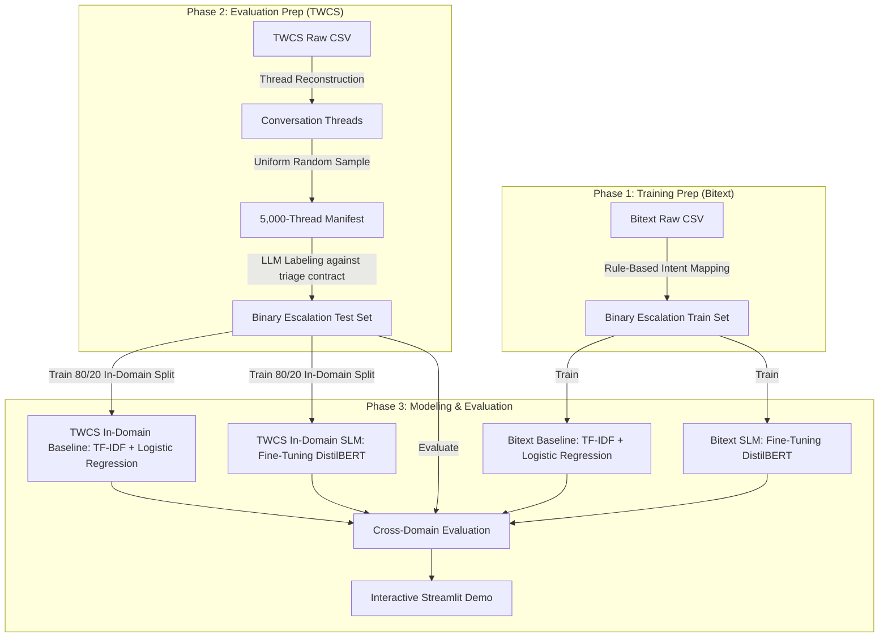

# Human-in-the-Loop: Cross-Domain Customer Support Escalation Classifier

[](https://opensource.org/licenses/MIT)
[](https://www.python.org/)
[](https://streamlit.io/)
[](https://huggingface.co/docs/transformers/model_doc/distilbert)

This repository contains the codebase and research framework for evaluating how well a Small Language Model (SLM) trained on structured intent data generalizes to noisy, real-world customer support interactions for escalation classification.

---

## 📌 Research Question

> **Can a fine-tuned small language model (DistilBERT) trained on clean, structured intent-labeled data (Bitext) generalize to classify customer support escalations in noisy, real-world conversational data (TWCS) compared to traditional baseline methods?**

### Why This Setup Matters
In industrial settings, building models from scratch is constrained by "cold start" scenarios where raw, labeled conversation data is scarce. Training a classifier on structured, synthetic, or templated datasets (like Bitext) and evaluating its generalization performance on unstructured, noisy real-world channels (like Twitter Customer Support) provides a rigorous benchmark for **domain generalization** and **model robustness**.

---

## 🗃️ Dataset Strategy & Roles

This project utilizes a two-dataset split to evaluate cross-domain generalization:

1. **Training Set: Bitext Customer Support Dataset**
   - *Characteristics:* 27K highly structured instruction-response pairs grouped by 27 intents and 10 categories.
   - *Labeling:* **Rule-Based (No LLM needed)**. Intents (such as `complaint`, `payment_issue`, `contact_human_agent`) are programmatically mapped directly to the binary escalation target:
     - `escalate = 1` (Requires human agent intervention)
     - `escalate = 0` (Can be handled by automated self-service bots)

2. **Cross-Domain Evaluation Set: Customer Support on Twitter (TWCS)**
   - *Characteristics:* Real-world, noisy social media posts featuring slang, abbreviations, emojis, and typos.
   - *Reconstruction:* Programmatically woven into multi-turn threads by tracing parent-child reply relationships.
   - *LLM Labeling:* A **5,000-thread uniform random sample** is labeled **by an LLM**, one thread at a time, against a published triage contract defining the 7 escalation categories.
   - *What the Labeler Sees:* The customer's **opening message only** — no agent replies, no `turn_count`. This matches the feature column the downstream classifier receives, so no label carries information the model cannot see.
   - *Dual Role:* Beyond serving as the cross-domain evaluation set for the Bitext-trained models, this labeled TWCS data is **also** split 80/20 to train **in-domain reference models** (TF-IDF and DistilBERT) on target Twitter vocabulary. These establish the achievable upper bound when real-world labels *are* available, isolating how much of the cross-domain gap stems from vocabulary mismatch versus model architecture.

---

## 🛠️ Technical Pipeline & Methodology


```mermaid
graph TD
    subgraph P1["Phase 1: Training Prep (Bitext)"]
        A1[Bitext Raw CSV] -->|Rule-Based Intent Mapping| B1[Binary Escalation Train Set]
    end

    subgraph P2["Phase 2: Evaluation Prep (TWCS)"]
        A2[TWCS Raw CSV] -->|Thread Reconstruction| B2[Conversation Threads]
        B2 -->|Uniform Random Sample| B3[5,000-Thread Manifest]
        B3 -->|LLM Labeling against triage contract| C2[Binary Escalation Test Set]
    end

    subgraph P3["Phase 3: Modeling & Evaluation"]
        B1 -->|Train| D[Bitext Baseline: TF-IDF + Logistic Regression]
        B1 -->|Train| E[Bitext SLM: Fine-Tuning DistilBERT]
        C2 -->|Train 80/20 In-Domain Split| H[TWCS In-Domain Baseline: TF-IDF + Logistic Regression]
        C2 -->|Train 80/20 In-Domain Split| I[TWCS In-Domain SLM: Fine-Tuning DistilBERT]
        C2 -->|Evaluate| F[Cross-Domain Evaluation]
        D --> F
        E --> F
        H --> F
        I --> F
        F --> G[Interactive Streamlit Demo]
    end
```

### 1. Rule-Based Mapping (Bitext)
We classify each of the 27 intents in the Bitext dataset into binary targets (`escalated = 1` vs. `escalated = 0`). Since Bitext is clean and pre-categorized, mapping is deterministic.

#### 📌 Operational Rationale for the 7 Escalated Intents (`escalated = 1`)
Out of the 27 Bitext intents, exactly 7 are designated as requiring human escalation based on standard Customer Experience (CX) and Operations taxonomy:

1. **Direct request of human agent:**
   - `contact_human_agent`, `contact_customer_service`: Direct customer requests for human intervention. Bypassing this request causes immediate CSAT drop.
2. **Negative Sentiment:**
   - `complaint`: Angry or dissatisfied customers require human empathy, negotiation, or goodwill compensation (discounts/vouchers) that bots cannot manage.
3. **Financial Liability:**
   - `payment_issue`, `get_refund`, `check_cancellation_fee`: Disbursing funds, failed transaction troubleshooting, or penalty fee disputes involve financial risk and policy overrides requiring human authorization.
4. **Account Access Blockers:**
   - `registration_problems`: Signup failures prevent new customer acquisition and require technical or identity verification.

The remaining 20 intents (`track_order`, `recover_password`, `delivery_period`, `check_invoice`, etc.) represent static FAQ lookups or deterministic API operations suitable for automated self-service bots (`escalated = 0`).

> ⚠️ **Two of those self-service mappings do not hold in the target domain.** In Bitext, `recover_password` and `check_invoice` are routine automated lookups. In real Twitter traffic the equivalent messages are *"my password is rejected and the 2FA code never arrives"* and *"you charged me twice, where is my money"* — cases that need a human. This label-space collision is the largest single source of cross-domain error we measured; see [Per-Category Cross-Domain Recall](#per-category-cross-domain-recall).

### 2. Thread Reconstruction & LLM Labeling (TWCS)
Raw tweets are stitched into multi-turn dialogues by following parent-child reply links. A **5,000-thread uniform random sample** is then labeled by an LLM (`claude-opus-5`), one thread at a time, against a published triage contract — the 7 escalation categories, the self-service categories, and the severity bar for `complaint`. The labeler sees the customer's **opening message only**: no agent replies. Every row records a free-text `reason`, so any label can be re-argued from the record.

> These labels are generated entirely by `claude-opus-5`. Given that the downstream models under evaluation are TF-IDF and DistilBERT, a frontier LLM provides a sufficiently reliable ground truth for this comparison. The Streamlit dashboard includes a human audit interface for reviewing and correcting labels to further strengthen the dataset.

### 3. Baseline Modeling
A classic machine learning pipeline (TF-IDF + Logistic Regression) is trained on the Bitext dataset to establish a performance floor. We additionally train a second, **in-domain** TF-IDF + Logistic Regression baseline directly on TWCS (80/20 split) to measure the ceiling achievable with target-domain vocabulary.

### 4. SLM Fine-Tuning
A pre-trained **DistilBERT** model (`distilbert-base-uncased`) is fine-tuned on the Bitext training set, optimizing hyperparameters such as learning rate and batch size. In parallel, we fine-tune an **in-domain** DistilBERT on the TWCS 80/20 split, giving us both a cross-domain and an in-domain SLM for comparison.

### 5. Performance Evaluation & Benchmarking
The Bitext-trained models are evaluated **cross-domain** on the full TWCS test set, while the TWCS-trained models are evaluated **in-domain** on their held-out 20% split. We analyze:
- **Generalization Drop:** Cross-domain performance (Bitext → TWCS) against both the in-domain Bitext ceiling and the in-domain TWCS reference.
- **Metric Breakdown:** F1-Score, Precision, Recall, and ROC-AUC.
- **Latency Benchmarks:** Inference time distribution (ms) on CPU vs. GPU.

---

## 📊 Results: TF-IDF Baselines

Full analysis in **[01_bitext_baseline_modeling.ipynb](notebooks/01_bitext_baseline_modeling.ipynb)** and **[02_twcs_baseline_modeling.ipynb](notebooks/02_twcs_baseline_modeling.ipynb)**.

### 1. What the data looks like
- **Cleaning.** The raw 26,872 Bitext pairs had no nulls, but **2,237 duplicate instructions** (`8.32%`) appeared in both train and test. Removing them leaves `24,635` rows.
- **Class balance.** Mapping 27 intents to the binary target gives **17,770 self-service** vs **6,865 escalated** — `72% / 28%`. That imbalance is why we report macro F1 and ROC-AUC rather than accuracy.
- **Linguistic tags.** Bitext ships per-row flags for colloquialisms, typos and negation. They cluster differently across categories — billing and complaint queries carry far more of them than order-tracking.

### 2. The baseline on Bitext

TF-IDF bigrams (`max_features=10,000`) + class-balanced Logistic Regression, on a stratified 20% test split (`4,927` queries):

| Metric | Score |
| :--- | :---: |
| **Macro F1** | **0.9975** |
| ROC-AUC | 0.9999 |
| Accuracy | 0.9980 |
| Precision (macro) | 0.9975 |
| Recall (macro) | 0.9975 |
| Latency | 0.1349 ms/query |

**Why so high?** Bitext is synthetic. Entities are placeholders (`{{Order Number}}`), and each intent has its own distinctive words, so a linear model separates them almost perfectly. This number measures the dataset, not the model.

### 3. The same model on real tweets

Scored against the 5,000 LLM-labeled TWCS threads, alongside a second TF-IDF trained *on* TWCS (80/20 split). Both read `first_customer_text` — the customer's opening message.

| Metric | Bitext (in-domain) | TWCS (in-domain) | TWCS (cross-domain) | Drop |
| :--- | :---: | :---: | :---: | :---: |
| **Macro F1** | **0.9975** | **0.7327** | **0.5816** | **−0.4159** |
| ROC-AUC | 0.9999 | 0.8258 | 0.5811 | −0.4188 |
| Accuracy | 0.9980 | 0.7640 | 0.6604 | −0.3376 |

### Recall by category, cross-domain

The average hides which intents survive the move:

| Escalation intent | Threads | Recall |
| :--- | :---: | :---: |
| `check_cancellation_fee` | 18 | **0.72** |
| `contact_human_agent` | 65 | 0.60 |
| `get_refund` | 112 | 0.52 |
| `contact_customer_service` | 169 | 0.52 |
| `payment_issue` | 281 | 0.35 |
| `complaint` | 759 | 0.32 |
| `registration_problems` | 125 | **0.20** |

**What this shows:**

- **The model memorised words, not meaning.** 41 points of macro F1 disappear moving from templated instructions to real tweets. It has no way to know that `wtf`, `sux` and `pls help` mean what its training examples meant.
- **Real labels buy back 15 points, not half.** Retraining on TWCS lifts `0.5816 → 0.7327`. The remaining `0.2648` is not a vocabulary problem — more Twitter text will not close it for a linear model.
- **`0.7327` is the ceiling for n-grams here.** That is what a bag of bigrams gets from the opening message alone, which is all a live system has when a tweet arrives.
- **The worst failures come from bad labels, not noise.** `registration_problems` (0.20) and `payment_issue` (0.35) have perfectly clear vocabulary. They fail because Bitext files password resets and invoice lookups as *self-service*, while on Twitter a lockout or a double charge is exactly what needs a human. The model reads the words correctly and applies the wrong rule — and the two things a support desk can least afford to misroute are locked-out users and missing money.

---

## 🤖 Results: DistilBERT

Full analysis in **[03_bitext_distilbert.ipynb](notebooks/03_bitext_distilbert.ipynb)**, **[04_twcs_distilbert.ipynb](notebooks/04_twcs_distilbert.ipynb)** and **[05_casing_comparison.ipynb](notebooks/05_casing_comparison.ipynb)**. All three reuse the baselines' exact 80/20 splits and verify it by re-scoring the saved TF-IDF pipelines before comparing anything.

> All F1 figures in this project are **macro** — averaged over both classes.

### 1. All four models

| | **Bitext** (synthetic) | **Cross-domain** (zero-shot) | **TWCS** (real labels) |
| :--- | :---: | :---: | :---: |
| **TF-IDF + Logistic Regression** | 0.9975 | 0.5816 | 0.7327 |
| **DistilBERT** | **0.9980** | 0.5568 | **0.7969** |

### 2. Where the gap goes

| | Macro F1 | |
| :--- | :---: | :--- |
| **What labels buy** (TF-IDF) | **+0.1511** | Retraining the linear model on real data |
| **What labels buy** (DistilBERT) | **+0.2401** | Same, for the transformer — the biggest single gain in the study |
| **What the model buys**, real data | +0.0642 | DistilBERT over TF-IDF, both trained on TWCS |
| **What the model buys**, zero-shot | **−0.0248** | Trained on Bitext, the transformer is *behind* the baseline |
| **What is left** | 0.2006 | `0.9975` − `0.7969`. Neither more data nor a better model recovers it |

### 3. What it costs

Both TWCS-trained models, same machine (Apple Silicon). Prediction is timed one query at a time, which is the worst case for the transformer — batching would close some of the gap.

| | TF-IDF | DistilBERT | Ratio |
| :--- | :---: | :---: | :---: |
| **Training** | `0.09 s` | `222 s` (4 epochs, GPU) | ~2,600x |
| **Predicting**, GPU | — | `6.38 ms` | 43x the CPU baseline |
| **Predicting**, CPU | `0.15 ms` | `12.02 ms` | 82x |

Neither number blocks anything at this scale — a retrain is a coffee break, and 6 ms disappears inside a support queue. The gap only starts to matter if you retrain constantly or serve at high volume, and it is the reason TF-IDF stays worth keeping as a fallback.

It is worth noting that a frontier LLM answering the same question takes roughly a second or more per thread over the network, and bills per token every time. DistilBERT runs on the machine you already have, at milliseconds, for nothing per query. That is the whole argument for distilling a frontier model's judgment into a 67M-parameter one: you pay the frontier price once, during labeling, instead of on every ticket forever.

### 4. Findings

- **The Bitext benchmark tells you nothing.** DistilBERT beats the bigram model by `0.0005` there — a handful of rows out of 4,927. Templated text is easy for both, so testing only on it would rank them as equivalent.
- **Trained on synthetic data and dropped onto tweets, the transformer is worse.** `0.5568` against `0.5816`. It does *order* the threads better (ROC-AUC `0.6271` vs `0.5811`), but it fits Bitext so completely that it becomes over-confident: nearly every tweet scores near zero, so at the usual `0.5` cut-off it flags almost nothing. Its best cut-off turns out to be `0.01`. Even given that best case, it still loses.
- **Real labels are worth ~4x a better model.** `+0.1511`/`+0.2401` from labels versus `+0.0642` from the architecture. **Spend the budget on labeling** — the transformer pays off afterwards, on the data you then have.
- **The in-domain gain is precision, not recall.** DistilBERT raises far fewer false alarms but misses slightly more escalations. Macro F1 likes that trade; a support desk might not, which is why notebook 04 picks the cut-off deliberately.
- **Bad labels cannot be fixed by a better model.** Both architectures failed on the same categories cross-domain, in nearly the same order, because both learned Bitext's rule that password resets are self-service. Trained on labels without that error, those categories recover.
- **Casing changes nothing.** `distilbert-base-cased` — same size, same loop, 3 seeds — moves macro F1 by `−0.0042`, a fraction of the variation between seeds. Keeping case costs 6% more tokens and 23% more `[UNK]` on every tweet, to recover emphasis present in 12% of them.
- **The transformer's cost is real but affordable.** ~2,600x the training time and ~43x the inference time of the baseline, and both are still small in absolute terms.

### 5. What we would deploy

The **TWCS in-domain DistilBERT** at a cut-off of **`0.20`** rather than `0.5`. Keep TF-IDF as a fallback for when the transformer is unavailable, not as a routing tier — the speed difference between them is real on paper and invisible in practice. Treat the Bitext-trained models as a cold-start bootstrap only: retire them once a few thousand real labels exist.

**Hand off what it isn't sure about to paid frontier LLM.** DistilBERT is confident on most threads and genuinely torn on a small slice, and that slice is where most of its mistakes live. Sending just those few to a paid frontier LLM catches a good share of the errors while leaving the vast majority of traffic on the cheap local model. the small model handles the volume, the expensive one handles the doubt, and a human sees whatever still looks wrong afterwards.

---

## 🔭 Future Improvements

- **A tweet-native encoder.** `distilbert-base-uncased` was pretrained on Wikipedia and books, and its
  tokenizer shows it: every emoji becomes `[UNK]`, and an `@handle` costs 6–8 subword fragments.
  [BERTweet](https://huggingface.co/vinai/bertweet-base) was pretrained on 850M tweets, carries emoji
  in its vocabulary, and normalizes handles and URLs to single tokens. The catch is size — at 135M
  parameters it is twice DistilBERT and no longer a *small* language model, so it belongs as a
  reference ceiling rather than a replacement. The version that keeps the premise intact is
  continued pretraining: more masked-language-model training on the 2.8M unlabeled tweets already in
  `twcs.csv`, keeping 67M parameters.

- **Validate the labels against humans.** Every number here measures agreement with `claude-opus-5`.
  Hand-labeling 200–300 threads from the same sample and reporting **Cohen's κ** against the LLM
  labels would turn "agrees with Opus" into a calibrated estimate of "agrees with a human". The
  audit tab in [`app.py`](app.py) exists to produce exactly that subsample.

- **Find out whether more labels help.** Labels were the largest lever in the study by a wide margin.
  A learning curve — retraining at 1k, 2k and 3.6k rows — would show whether the curve is still
  climbing or has flattened, and so whether another labeling round is worth funding.

- **Fix the starved categories.** `contact_human_agent` has only 65 threads in the whole sample and is
  the model's weakest category. Explicit requests for a human are also the least forgivable thing to
  miss, and they are unambiguous enough that a keyword rule ahead of the model would likely serve
  better than waiting for more training examples.

---

## 📁 Repository Structure

```text
human-loop/
├── data/                       # Dataset storage (ignored by Git)
│   ├── bitext/                 # Bitext training dataset
│   └── twcs/                   # Twitter Customer Support dataset
├── models/                     # Serialized artifacts & evaluation metrics
│   ├── cross_domain_metrics_tfidf.json      # Bitext -> TWCS, TF-IDF
│   ├── cross_domain_metrics_distilbert.json # Bitext -> TWCS, DistilBERT
│   ├── final_benchmark.json    # Four-model 2x2 summary & gap decomposition
│   ├── bitext/
│   │   ├── tfidf/              # tfidf_bitext.pkl, bitext_metrics.json
│   │   └── distilbert/         # weights (gitignored) + bitext_distilbert_metrics.json
│   └── twcs/
│       ├── tfidf/              # tfidf_twcs.pkl, twcs_metrics.json
│       └── distilbert/         # weights (gitignored) + twcs_distilbert_metrics.json,
│                               #   casing_comparison.json
├── src/
│   └── distilbert_utils.py     # Fine-tuning loop used by notebooks 03-05
├── notebooks/                  # Jupyter notebooks for EDA and experimentation
│   ├── 01_bitext_baseline_modeling.ipynb # Primary EDA & baseline modeling notebook
│   ├── 02_twcs_baseline_modeling.ipynb # TWCS cross-domain evaluation & in-domain TF-IDF baseline
│   ├── 03_bitext_distilbert.ipynb # DistilBERT on Bitext + cross-domain transfer
│   ├── 04_twcs_distilbert.ipynb # DistilBERT in-domain on TWCS + final 2x2 benchmark
│   └── 05_casing_comparison.ipynb # Casing comparison (uncased vs cased)
├── docs/                       # Screenshots and documentation assets
│   └── ui.png
├── app.py                      # Interactive Streamlit demo & label review UI
├── requirements.txt            # Python dependencies
└── README.md                   # Project documentation
```

---

## 📓 Explore the Notebooks

The full analysis, visualizations, and results are already captured in the five notebooks below — the datasets have been preprocessed, labeled, and modeled, and the trained artifacts live in [`models/`](models/). **No re-running of the pipeline is required to follow the work** — just open the notebooks:

| Notebook | What's Inside |
| :--- | :--- |
| **[01_bitext_baseline_modeling.ipynb](notebooks/01_bitext_baseline_modeling.ipynb)** | EDA, data cleaning, feature engineering, and the in-domain TF-IDF + Logistic Regression baseline on the Bitext dataset (`macro F1 = 0.9975`). |
| **[02_twcs_baseline_modeling.ipynb](notebooks/02_twcs_baseline_modeling.ipynb)** | The cross-domain vs. in-domain benchmark on the LLM-labeled sample (`0.5816` cross-domain vs. `0.7327` in-domain F1), plus per-category recall. |
| **[03_bitext_distilbert.ipynb](notebooks/03_bitext_distilbert.ipynb)** | DistilBERT fine-tuned on Bitext (`0.9980` in-domain), its zero-shot transfer to TWCS (`0.5568`), the calibration analysis showing why a better-ranking model makes worse decisions, and per-category transfer against the baseline. |
| **[04_twcs_distilbert.ipynb](notebooks/04_twcs_distilbert.ipynb)** | Learning-rate sweep and in-domain DistilBERT on TWCS (`0.7969`, 3-seed mean), the operating-threshold cost analysis, per-category recovery, and the final four-model 2×2 with the gap decomposition. |
| **[05_casing_comparison.ipynb](notebooks/05_casing_comparison.ipynb)** | A controlled comparison testing whether `distilbert-base-cased` recovers the ALL-CAPS signal lowercasing discards. It does not (`−0.0042`, inside the noise floor), and the tokenizer statistics explain why. |

*Optional — to run the notebooks locally, install the dependencies first:*
```bash
pip install -r requirements.txt   # or: uv pip install -r requirements.txt
```

> [!NOTE]
> The fine-tuned DistilBERT weights (`models/*/distilbert/`, ~256 MB each) are **gitignored** — they are regenerated by executing notebooks 03 and 04, which takes roughly 6 and 12 minutes respectively on an Apple M3 Pro. The evaluation metrics beside them (`*_distilbert_metrics.json`, `final_benchmark.json`) **are** tracked, so every number quoted above is verifiable without retraining anything. Fine-tuning on MPS is not bit-deterministic, so a re-run reproduces these figures to within ~0.005 macro F1 rather than exactly.

---

## 🚀 Running the Dashboard

```bash
pip install -r requirements.txt
streamlit run app.py
```

The app opens two tabs:

1. **Live Triage Simulator** — type a customer message and get an escalation prediction from the trained TF-IDF model (`models/twcs/tfidf/tfidf_twcs.pkl`).
2. **Human Label Audit** — review and correct LLM-generated labels from `llm_labeled_5k.csv`.


> [!NOTE]
> The triage model must exist before the simulator tab works. If it's missing, train it via the code in **Notebook 02**.

---

## 📄 License
This project is licensed under the MIT License - see the LICENSE file for details.
