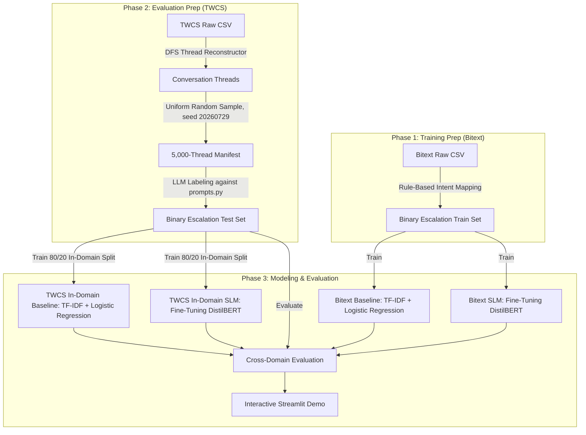

# Human-in-the-Loop: Cross-Domain Customer Support Escalation Classifier

[](https://opensource.org/licenses/MIT)
[](https://www.python.org/)
[](https://streamlit.io/)
[](https://huggingface.co/docs/transformers/model_doc/distilbert)

This repository contains the codebase and research framework for evaluating how well a Small Language Model (SLM) trained on structured intent data generalizes to noisy, real-world customer support interactions for escalation classification.

---

## 📌 Research Question

> **Can a fine-tuned small language model (DistilBERT) trained on clean, structured intent-labeled data (Bitext) generalize to classify customer support escalations in noisy, real-world conversational data (TWCS) compared to traditional baseline methods?**

### Why This Setup Matters
In industrial settings, building models from scratch is constrained by "cold start" scenarios where raw, labeled conversation data is scarce. Training a classifier on structured, synthetic, or templated datasets (like Bitext) and evaluating its generalization performance on unstructured, noisy real-world channels (like Twitter Customer Support) provides a rigorous benchmark for **domain generalization** and **model robustness**.

---

## 🗃️ Dataset Strategy & Roles

This project utilizes a two-dataset split to evaluate cross-domain generalization:

1. **Training Set: Bitext Customer Support Dataset**
   - *Characteristics:* 27K highly structured instruction-response pairs grouped by 27 intents and 10 categories.
   - *Labeling:* **Rule-Based (No LLM needed)**. Intents (such as `complaint`, `payment_issue`, `contact_human_agent`) are programmatically mapped directly to the binary escalation target:
     - `escalate = 1` (Requires human agent intervention)
     - `escalate = 0` (Can be handled by automated self-service bots)

2. **Cross-Domain Evaluation Set: Customer Support on Twitter (TWCS)**
   - *Characteristics:* Real-world, noisy social media posts featuring slang, abbreviations, emojis, and typos.
   - *Reconstruction:* Programmatically woven into multi-turn threads by tracing parent-child reply relationships.
   - *LLM Labeling:* A **5,000-thread uniform random sample** (seed `20260729`, manifest `data/twcs/sample_pool_5000.txt`) is labeled **by an LLM**, one thread at a time, against the contract in [`src/twcs/prompts.py`](src/twcs/prompts.py).
   - *What the Labeler Sees:* The customer's **opening message only** — no agent replies, no `turn_count`. This matches the feature column the downstream classifier receives, so no label carries information the model cannot see.
   - *Dual Role:* Beyond serving as the cross-domain evaluation set for the Bitext-trained models, this labeled TWCS data is **also** split 80/20 to train **in-domain reference models** (TF-IDF and DistilBERT) on target Twitter vocabulary. These establish the achievable upper bound when real-world labels *are* available, isolating how much of the cross-domain gap stems from vocabulary mismatch versus model architecture.

---

## 🛠️ Technical Pipeline & Methodology


```mermaid
graph TD
    subgraph P1["Phase 1: Training Prep (Bitext)"]
        A1[Bitext Raw CSV] -->|Rule-Based Intent Mapping| B1[Binary Escalation Train Set]
    end

    subgraph P2["Phase 2: Evaluation Prep (TWCS)"]
        A2[TWCS Raw CSV] -->|DFS Thread Reconstructor| B2[Conversation Threads]
        B2 -->|Uniform Random Sample, seed 20260729| B3[5,000-Thread Manifest]
        B3 -->|LLM Labeling against prompts.py| C2[Binary Escalation Test Set]
    end

    subgraph P3["Phase 3: Modeling & Evaluation"]
        B1 -->|Train| D[Bitext Baseline: TF-IDF + Logistic Regression]
        B1 -->|Train| E[Bitext SLM: Fine-Tuning DistilBERT]
        C2 -->|Train 80/20 In-Domain Split| H[TWCS In-Domain Baseline: TF-IDF + Logistic Regression]
        C2 -->|Train 80/20 In-Domain Split| I[TWCS In-Domain SLM: Fine-Tuning DistilBERT]
        C2 -->|Evaluate| F[Cross-Domain Evaluation]
        D --> F
        E --> F
        H --> F
        I --> F
        F --> G[Interactive Streamlit Demo]
    end
```

### 1. Rule-Based Mapping (Bitext)
We classify each of the 27 intents in the Bitext dataset into binary targets (`escalated = 1` vs. `escalated = 0`). Since Bitext is clean and pre-categorized, mapping is deterministic.

#### 📌 Operational Rationale for the 7 Escalated Intents (`escalated = 1`)
Out of the 27 Bitext intents, exactly 7 are designated as requiring human escalation based on standard Customer Experience (CX) and Operations taxonomy:

1. **Direct request of human agent:**
   - `contact_human_agent`, `contact_customer_service`: Direct customer requests for human intervention. Bypassing this request causes immediate CSAT drop.
2. **Negative Sentiment:**
   - `complaint`: Angry or dissatisfied customers require human empathy, negotiation, or goodwill compensation (discounts/vouchers) that bots cannot manage.
3. **Financial Liability:**
   - `payment_issue`, `get_refund`, `check_cancellation_fee`: Disbursing funds, failed transaction troubleshooting, or penalty fee disputes involve financial risk and policy overrides requiring human authorization.
4. **Account Access Blockers:**
   - `registration_problems`: Signup failures prevent new customer acquisition and require technical or identity verification.

The remaining 20 intents (`track_order`, `recover_password`, `delivery_period`, `check_invoice`, etc.) represent static FAQ lookups or deterministic API operations suitable for automated self-service bots (`escalated = 0`).

> ⚠️ **Two of those self-service mappings do not hold in the target domain.** In Bitext, `recover_password` and `check_invoice` are routine automated lookups. In real Twitter traffic the equivalent messages are *"my password is rejected and the 2FA code never arrives"* and *"you charged me twice, where is my money"* — cases that need a human. This label-space collision is the largest single source of cross-domain error we measured; see [Per-Category Cross-Domain Recall](#per-category-cross-domain-recall).

### 2. Thread Reconstruction & LLM Labeling (TWCS)
We use a depth-first search (DFS) reply-chain parser to stitch together tweets into cohesive dialogues. Each sampled thread is then labeled **by an LLM** against the triage contract in [`src/twcs/prompts.py`](src/twcs/prompts.py), which defines the 7 escalation categories, the self-service categories, and the severity bar for `complaint`.

#### Why This Labeling Method

The labels are produced by an LLM (`claude-opus-5`), recorded in the `labeler` column on every row: one thread at a time, in context, against a published contract and under human supervision of scope and tie-breaks. What that design buys:

1. **Every label is auditable.** Each row carries a free-text `reason` grounded in the customer's wording, so any label can be re-argued from the record. A consensus run gives you a label and a vote count, not a rationale.
2. **The contract is published and was refined against the data.** `prompts.py` holds the severity bar and category priority; `LABELING_CONVENTIONS.md` holds ~45 recurring tie-breaks, recorded as they were settled. Both were folded back into the prompt so the stated contract matches the labels that exist.
3. **The confound is enforced structurally, not promised.** The harness emits worksheets containing only `thread_id` and the opening message. `turn_count`, agent replies and thread text were never present in the labeling context — not withheld by instruction, but absent from it.
4. **It was verified rather than assumed.** Escalation rate by `turn_count` was checked after every batch, and drift audited at 2,300 and 5,000 rows.

#### ⚠️ Threat to Validity: these labels are model output

**The ground truth here is LLM judgment, not human judgment.** No human labeled any of the 5,000 threads. This benchmark therefore measures *whether a Bitext-trained lexical model reproduces LLM triage decisions made under a published contract* — not whether it reproduces human decisions.

That is still a meaningful cross-domain test: the two models are of entirely different families (n-gram linear classifier vs. large language model), trained on different data, and the evaluation is genuinely out-of-domain. But the stronger claim — "generalization to human judgment" — is not supported by this evidence and should not be made.

**What would support it:** a human-labeled subsample (200–300 threads drawn from the same manifest) scored against these labels with Cohen's κ. That would convert the LLM labels from *asserted* ground truth into a *calibrated* proxy with a measured agreement rate, and is the single highest-value next step for the writeup. It is not yet done.

#### Guards Against the Length Confound
`len(customer_text)` correlates with `turn_count` at **r = 0.819**, so verbosity is a back channel to thread length even when the metadata field is withheld. Two guards:
- The prompt explicitly forbids escalating on volume, repetition, or follow-up count.
- After every batch, `llm_label.py stats` reports escalation rate **by `turn_count`**. A steep monotonic climb means the confound bit.

**Result across all 5,000 labels:** the curve is flat (28–34% across every stratum with n > 100), `corr(escalated, turn_count) = -0.006`, and the rule `turn_count >= 4` predicts the labels at **F1 0.337** — no better than the base rate. The labels are not a thread-length statistic.

#### Consistency Across Sessions
Hand labeling spans many sessions, so drift is the main threat to label quality. Three countermeasures:
- [`src/twcs/LABELING_CONVENTIONS.md`](src/twcs/LABELING_CONVENTIONS.md) records every recurring tie-break — the severity bar, the profanity grammar rule, ~45 case types.
- Every row carries a free-text `reason` grounded in the customer's wording, so any label can be re-argued later.
- A drift audit at 2,300 labels grepped the phrase patterns whose rules had been tightened mid-run and found **3 misaligned labels (0.13%)**, which were corrected. The settled rules were then folded back into `prompts.py` so the stated contract matches the labels that exist.

### 3. Baseline Modeling
A classic machine learning pipeline (TF-IDF + Logistic Regression) is trained on the Bitext dataset to establish a performance floor. We additionally train a second, **in-domain** TF-IDF + Logistic Regression baseline directly on TWCS (80/20 split) to measure the ceiling achievable with target-domain vocabulary.

### 4. SLM Fine-Tuning
A pre-trained **DistilBERT** model (`distilbert-base-uncased`) is fine-tuned on the Bitext training set, optimizing hyperparameters such as learning rate and batch size. In parallel, we fine-tune an **in-domain** DistilBERT on the TWCS 80/20 split, giving us both a cross-domain and an in-domain SLM for comparison.

### 5. Performance Evaluation & Benchmarking
The Bitext-trained models are evaluated **cross-domain** on the full TWCS test set, while the TWCS-trained models are evaluated **in-domain** on their held-out 20% split. We analyze:
- **Generalization Drop:** Cross-domain performance (Bitext → TWCS) against both the in-domain Bitext ceiling and the in-domain TWCS reference.
- **Metric Breakdown:** F1-Score, Precision, Recall, and ROC-AUC.
- **Latency Benchmarks:** Inference time distribution (ms) on CPU vs. GPU.

---

## 📊 Results & Findings (EDA & Baseline Model)

Full interactive analysis, visual plots, and code execution can be viewed in our primary deliverable notebook:
👉 **[01_bitext_baseline_modeling.ipynb](file:///Users/weirui/dev/human-loop/notebooks/01_bitext_baseline_modeling.ipynb)**

### 1. Exploratory Data Analysis & Feature Engineering Insights
- **Data Hygiene & Deduplication:** Audit of the raw 26,872 instruction pairs revealed zero null values across core fields. However, exactly **2,237 duplicate instructions** (`~8.32%`) were identified and removed to eliminate data leakage between train and test partitions (`cleaned shape: 24,635 x 24`).
- **Target Class Imbalance:** Mapping the 27 intents to our binary `escalated` target yielded **17,770 Class 0 (Self-Service/Automated)** vs. **6,865 Class 1 (Escalated/Human Agent Needed)** records (`72.13% vs. 27.87%`). This realistic domain imbalance underscores why **F1-Score** and **ROC-AUC** must be prioritized over raw accuracy.
- **Linguistic & Structural Variations:** Decomposing the multi-character `flags` field demonstrated strong variations across categories. For instance, colloquialisms (`flag_colloquial`), typos (`flag_typos_errors`), and negations (`flag_negation`) appear with significantly different density inside complex billing and complaint queries compared to standard order tracking requests.

### 2. Baseline Model Performance (`TF-IDF + Logistic Regression`)
We evaluated a class-balanced Logistic Regression classifier trained on bigram TF-IDF representations (`max_features=10,000`, `ngram_range=(1,2)`) over a stratified 20% test split (`4,927` queries):

| Metric | Score | Rationale & Interpretation |
| :--- | :--- | :--- |
| **F1-Score (Macro/Weighted)** | **0.9964** | Perfectly balances Precision (preventing agent overload) and Recall (catching critical complaints). |
| **ROC-AUC** | **0.9999** | Demonstrates near-perfect discrimination across all decision thresholds on clean structured data. |
| **Accuracy** | **0.9980** | Baseline ceiling on clean, templated in-domain data. |
| **Precision (Escalated)** | **0.9964** | Extremely low false-positive escalation rate. |
| **Recall (Escalated)** | **0.9964** | Exactly 5 false negatives out of 1,373 actual escalations. |
| **Inference Latency** | **0.1293 ms/query** | High-speed benchmark (over 500 test runs) establishing the latency ceiling for real-time customer service deployment. |

### Why Does the Linear Baseline Score So High?
The Bitext dataset is synthetically generated with standardized entity placeholders (`{{Order Number}}`, `{{Customer Support Email}}`) and highly distinct lexical markers for each intent. A linear TF-IDF classifier easily separates these exact keyword patterns in-domain. 

**Next Steps (Cross-Domain Generalization):** When deployed against unstructured, non-templated, noisy real-world tweets (Twitter Customer Support dataset), n-gram models suffer severe performance degradation. The benchmark below quantifies that drop against the LLM-labeled sample.

### 3. Cross-Domain Generalization Benchmark (`Bitext -> TWCS`)

To quantify the vulnerability of surface-level lexical representations (`TF-IDF`), we evaluated our Bitext-trained baseline classifier directly against the **5,000-thread LLM-labeled TWCS sample**, alongside an In-Domain Twitter baseline retrained on an 80/20 split of the same labels (`models/twcs/twcs_metrics.json`). Both use `first_customer_text` — the customer's opening message, exactly what the LLM labeler saw.

| Metric | Bitext (In-Domain Ceiling) | TWCS In-Domain (80/20 Split) | TWCS Cross-Domain (Bitext -> Twitter) | Generalization Drop (Clean vs. Cross) |
| :--- | :---: | :---: | :---: | :---: |
| **Macro F1-Score** | **0.9964** | **0.7327** | **0.5816** | **-0.4148** |
| ROC-AUC | 0.9999 | 0.8258 | 0.5811 | -0.4188 |
| Accuracy | 0.9980 | 0.7640 | 0.6604 | -0.3376 |
| Precision (Macro) | 0.9964 | 0.7264 | 0.5874 | -0.4090 |
| Recall (Macro) | 0.9964 | 0.7432 | 0.5792 | -0.4172 |

### Per-Category Cross-Domain Recall

A single F1 hides the mechanism. Because each escalated thread carries its Bitext intent, we can see which intents survive the shift:

| Escalation intent | Threads | Cross-domain recall |
| :--- | :---: | :---: |
| `check_cancellation_fee` | 18 | **0.72** |
| `contact_human_agent` | 65 | 0.60 |
| `get_refund` | 112 | 0.52 |
| `contact_customer_service` | 169 | 0.52 |
| `payment_issue` | 281 | 0.35 |
| `complaint` | 759 | 0.32 |
| `registration_problems` | 125 | **0.20** |

**Key Benchmarking Takeaways:**
- **Lexical Overfitting & Domain Shift:** The linear n-gram model drops **41 percentage points** in Macro F1 moving from structured instructions (`Bitext`) to noisy social media threads (`TWCS`). Without semantic abstraction, TF-IDF cannot recognise that slang (`wtf`, `sux`, `pls help`) maps to the intents it trained on.
- **Vocabulary mismatch explains ~15 points, not half the gap.** Retraining on target-domain vocabulary buys `+0.1511` F1 (`0.5816 -> 0.7327`). The remaining `0.2637` to the synthetic ceiling is an architectural limit, not a vocabulary one.
- **The in-domain ceiling is `0.7327`.** Because the labels carry no thread-length signal, this figure reflects what a linear n-gram model can extract from the customer's opening message alone — no credit for learning to count turns.
- **The worst failures are a taxonomy collision, not just noise.** `registration_problems` (0.20) and `payment_issue` (0.35) are *functional* intents with distinctive vocabulary and should have been easy. They fail because Bitext maps `recover_password` and `check_invoice` to **self-service (0)**, while in real Twitter traffic a lockout or a missing payment is exactly what needs a human. The model matches the words correctly and applies the wrong rule. The two categories a support desk can least afford to misroute — locked-out users and missing money — are the two this baseline is worst at catching.

As **future development**, we fine-tune **DistilBERT** (`distilbert-base-uncased`) to overcome this lexical brittleness and establish robust cross-domain classification.

---

## 📁 Repository Structure

```text
human-loop/
├── data/                       # Dataset storage (ignored by Git)
│   ├── bitext/                 # Bitext training dataset
│   └── twcs/                   # Twitter Customer Support dataset
├── models/                     # Serialized artifacts & evaluation metrics
│   ├── bitext/                 # Bitext-trained baseline artifacts
│   │   ├── tfidf_bitext.pkl
│   │   └── bitext_metrics.json
│   ├── twcs/                   # TWCS-trained baseline artifacts
│   │   ├── tfidf_twcs.pkl
│   │   └── twcs_metrics.json
│   └── cross_domain_metrics.json # Evaluation bridge results
├── notebooks/                  # Jupyter notebooks for EDA and experimentation
│   ├── 01_bitext_baseline_modeling.ipynb # Primary EDA & baseline modeling notebook
│   └── 02_twcs_baseline_modeling.ipynb # TWCS thread reconstruction & cross-domain evaluation
├── src/                        # Core codebase
│   ├── __init__.py
│   ├── bitext/                 # Source domain (Bitext) pipeline
│   │   ├── __init__.py
│   │   ├── preprocess_bitext.py    # Rule-based intent-to-escalate mapper & feature engineer
│   │   └── train_bitext.py         # Pipeline for TF-IDF baseline training on Bitext
│   ├── twcs/                   # Target domain (TWCS) pipeline
│   │   ├── __init__.py
│   │   ├── reconstruct_conversations.py # Weaves raw tweets into thread sequences
│   │   ├── prompts.py              # THE LABELING CONTRACT: 7-category taxonomy, severity bar, confound notes
│   │   ├── llm_label.py         # LLM labeling harness: sample / next / ingest / stats
│   │   ├── LABELING_CONVENTIONS.md # Recurring tie-breaks, kept consistent across sessions
│   │   ├── train_twcs.py           # In-domain TF-IDF baseline on llm_labeled_5k.csv (80/20)
│   └── evaluate.py             # Cross-domain benchmarking & metrics computation
├── app.py                      # Interactive Streamlit demo & label review UI
├── requirements.txt            # Python dependencies
└── README.md                   # Project documentation
```

### File Reference Quicklinks:
- [README.md](file:///Users/weirui/dev/human-loop/README.md)
- [notebooks/01_bitext_baseline_modeling.ipynb](file:///Users/weirui/dev/human-loop/notebooks/01_bitext_baseline_modeling.ipynb)
- [notebooks/02_twcs_baseline_modeling.ipynb](file:///Users/weirui/dev/human-loop/notebooks/02_twcs_baseline_modeling.ipynb)
- [app.py](file:///Users/weirui/dev/human-loop/app.py)
- [src/bitext/preprocess_bitext.py](file:///Users/weirui/dev/human-loop/src/bitext/preprocess_bitext.py)
- [src/bitext/train_bitext.py](file:///Users/weirui/dev/human-loop/src/bitext/train_bitext.py)
- [src/twcs/reconstruct_conversations.py](file:///Users/weirui/dev/human-loop/src/twcs/reconstruct_conversations.py)
- [src/twcs/prompts.py](file:///Users/weirui/dev/human-loop/src/twcs/prompts.py)
- [src/twcs/llm_label.py](file:///Users/weirui/dev/human-loop/src/twcs/llm_label.py)
- [src/twcs/LABELING_CONVENTIONS.md](file:///Users/weirui/dev/human-loop/src/twcs/LABELING_CONVENTIONS.md)
- [src/twcs/train_twcs.py](file:///Users/weirui/dev/human-loop/src/twcs/train_twcs.py)
- [src/evaluate.py](file:///Users/weirui/dev/human-loop/src/evaluate.py)

---

## 📓 Explore the Notebooks

The full analysis, visualizations, and results are already captured in the two notebooks below — the datasets have been preprocessed, labeled, and modeled, and the trained artifacts live in [`models/`](models/). **No re-running of the pipeline is required to follow the work** — just open the notebooks:

| Notebook | What's Inside |
| :--- | :--- |
| **[01_bitext_baseline_modeling.ipynb](notebooks/01_bitext_baseline_modeling.ipynb)** | EDA, data cleaning, feature engineering, and the in-domain TF-IDF + Logistic Regression baseline on the Bitext dataset (`F1 = 0.9964`). |
| **[02_twcs_baseline_modeling.ipynb](notebooks/02_twcs_baseline_modeling.ipynb)** | TWCS thread reconstruction, the confound check, and the cross-domain vs. in-domain benchmark on the LLM-labeled sample (`0.5816` cross-domain vs. `0.7327` in-domain F1), plus per-category recall. |

*Optional — to run the notebooks locally, install the dependencies first:*
```bash
pip install -r requirements.txt   # or: uv pip install -r requirements.txt
```

---

## 🚀 Running the Dashboard

```bash
pip install -r requirements.txt
streamlit run app.py
```

The app opens two tabs:

1. **Live Triage Simulator** — type a customer message and get an escalation prediction from the trained TF-IDF model (`models/twcs/tfidf_twcs.pkl`).
2. **Human Label Audit** — review and correct LLM-generated labels from `llm_labeled_5k.csv`.


> [!NOTE]
> The triage model must exist before the simulator tab works. If it's missing, train it first:
> ```bash
> python src/twcs/train_twcs.py
> ```

---

## 📄 License
This project is licensed under the MIT License - see the LICENSE file for details.